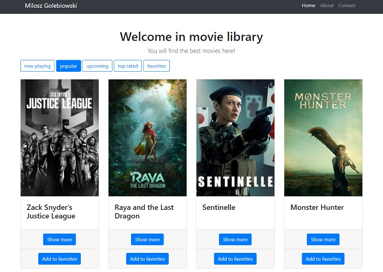

Project Name: Flask API Movies library

I used here API TMDb to create movie library where you can search movies by categories. Website front-end is based on bootstrap and application is connected to the PostgreSQL database.

How To Setup
1. Clone This Project git clone 
2. Enter Project Directory cd movies_flask_app
3. Create a Virtual Environment (for Windows) py -m venv (name your virtual enviroment) my_venv_environ
- py -m venv venv
4. Activate Virtual Environment source: venv/Scripts/activate
5. Install Requirements Package pip install -r requirements.txt
6. Finally Run The Project:
python main.py

Preview

